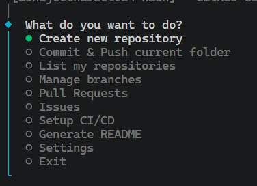
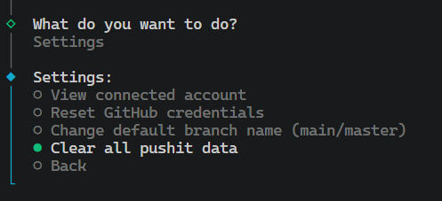

<div align="center">
  <h1>🚀 pushit-cli</h1>
  <p><b>The Ultimate Interactive GitHub Workflow CLI</b></p>

  [](https://www.npmjs.com/package/pushit-cli)
  [](#license)
  [](https://makeapullrequest.com)

  <br />
  
  <p align="center">
    
    &nbsp;
    
  </p>

  <br />
</div>

---

**`pushit-cli`** is a production-ready, highly interactive CLI tool that brings the entire GitHub experience directly into your terminal. Say goodbye to constantly switching between your terminal and browser. Create repositories, push code, manage branches, handle pull requests, and resolve issues—all without ever leaving your command line.

## ✨ Features

- 🆕 **One-Click Repo Creation**: Interactively create a repository, generate a README, add a `.gitignore`, pick a License, and push your code in a single fluid motion.
- 📤 **Smart Commit & Push**: Interactive file staging with built-in conventional commits (`feat:`, `fix:`, `docs:`). No more messy git logs.
- 🗑️ **Bulk Repository Management**: Easily view paginated lists of your repositories, clone them instantly, or bulk-delete multiple repos at once.
- 🌿 **Advanced Branching**: Switch, create, view, and delete branches through a beautiful CLI interface.
- 🔀 **Pull Requests & Issues**: Browse, create, and manage PRs and Issues seamlessly.
- 🚀 **Zero-Friction Authentication**: Uses OAuth Device Flow for a one-time, incredibly smooth login process.

## 📦 Requirements

- **Node.js** `v18.0.0` or higher
- Git installed on your machine

## ⚡ Installation

Install `pushit-cli` globally using npm so you can run it from any directory on your machine:

```bash
npm install -g pushit-cli
```

## 🚀 Quick Start

To launch the interactive dashboard, simply run the following command in any project folder:

```bash
pushit
```

*On your very first run, it will ask you to quickly authenticate your GitHub account using a secure 4-digit code. After that, you're good to go forever!*

## 🤝 Contributing

Contributions, issues, and feature requests are always welcome! Feel free to check the [issues page](../../issues). 

1. Fork the Project
2. Create your Feature Branch (`git checkout -b feat/AmazingFeature`)
3. Commit your Changes (`git commit -m 'feat: Add some AmazingFeature'`)
4. Push to the Branch (`git push origin feat/AmazingFeature`)
5. Open a Pull Request

## 📝 License

Distributed under the MIT License. See `LICENSE` for more information.

---
<div align="center">
  Built with ❤️ by Abhijeet Nardele
</div>
