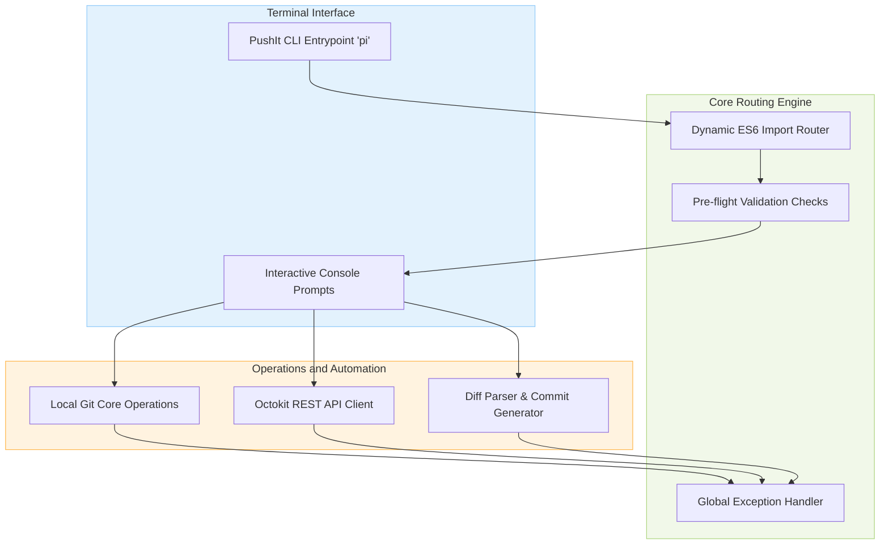

<div align="center">
  <pre>
  ___ _   _ ___ _  _ ___ _____ 
 | _ \ | | / __| || |_ _|_   _|
 |  _/ |_| \__ \ __ || |  | |  
 |_|  \___/|___/_||_|___| |_|  
  </pre>
  <h1>PushIt CLI</h1>
  <p><b>Advanced Interactive GitHub Workflow and Developer Productivity Engine</b></p>

  [](https://www.npmjs.com/package/pushit-cli)
  []()
  [](#license)
  []()
  
  <br />

  **If you find PushIt CLI helpful, please give it a Star on GitHub!**
</div>

---

## 1. Overview

PushIt CLI is an enterprise-grade, terminal-native application designed to optimize and automate the modern developer's Git and GitHub workflows. 

By abstracting complex Git operations and GitHub REST API interactions into a centralized, interactive command-line dashboard, PushIt CLI drastically reduces context switching. From algorithmic AI commit generation to granular interactive file staging and robust undo management, the CLI serves as a unified productivity tool for software engineering teams.

## 2. Core Capabilities

- **Algorithmic Commit Generation**: Automatically analyzes `git diff` outputs to generate context-aware, conventional commit messages (`feat`, `fix`, `chore`, etc.), ensuring pristine Git history without manual overhead.
- **Interactive File Staging**: Replaces standard `git add .` operations with a precise, multi-select terminal buffer, allowing developers to meticulously curate their staging area.
- **Git Undo Management**: Safely perform soft resets and manipulate the `HEAD` pointer without corrupting the working directory, supported by an interactive stash manager.
- **Automated Repository Bootstrapping**: Interfaces directly with the GitHub API to instantly initialize remote repositories, pull standard `.gitignore` profiles, and apply licensing templates.

---

## 3. Installation & Setup

PushIt CLI is distributed as a global Node.js binary. Ensure your local environment meets the minimum requirements before installation.

### 3.1 Prerequisites
- **Node.js**: Version 18.0.0 or higher.
- **Git**: Installed and available in your system path.

### 3.2 Global Installation
Install the package globally via NPM to register the binary commands:

```bash
npm install -g pushit-cli
```

### 3.3 Initial Configuration
On the first execution, PushIt CLI requires authorization to interact with your GitHub account. 

1. Run the CLI using the `pi` command.
2. The CLI will initiate the GitHub OAuth Device Flow and provide an 8-character code.
3. Press `Enter` to open your browser, paste the code, and grant access.
4. Your secure OAuth token is encrypted and persisted locally for all future sessions.

---

## 4. Getting Started

PushIt CLI registers two global commands: `pushit` and the shorthand `pi`. 

Navigate to any local Git repository (or an empty directory if you intend to initialize a new repository) and execute the CLI:

```bash
cd /path/to/your/project
pi
```

### The Interactive Dashboard
Upon launch, you will be presented with a navigable menu driven by your arrow keys. 
- Select **"Stage & Commit"** to enter the interactive multi-select buffer for your modified files.
- Select **"Undo Last Commit"** to securely revert your `HEAD` pointer.
- Select **"Initialize Remote"** to rapidly bootstrap a new GitHub repository from your local directory.

---

## 5. System Architecture & Design

PushIt CLI is engineered as an open-source, extensible platform. It utilizes a modular, middleware-driven architecture to ensure fault tolerance and rapid execution times.


```mermaid
graph TD
    subgraph TerminalInterface [Terminal Interface]
        CLI[PushIt CLI Entrypoint 'pi']
        Prompts[Interactive Console Prompts]
    end

    subgraph CoreRoutingEngine [Core Routing Engine]
        Router[Dynamic ES6 Import Router]
        Middleware[Pre-flight Validation Checks]
        Error[Global Exception Handler]
    end

    subgraph OperationsAutomation [Operations and Automation]
        GitOps[Local Git Core Operations]
        GitHubAPI[Octokit REST API Client]
        AIEngine[Diff Parser & Commit Generator]
    end

    CLI --> Router
    Router --> Middleware
    Middleware --> Prompts
    
    Prompts --> GitOps
    Prompts --> GitHubAPI
    Prompts --> AIEngine
    
    GitOps --> Error
    GitHubAPI --> Error
    AIEngine --> Error

    style TerminalInterface fill:#e3f2fd,stroke:#90caf9
    style CoreRoutingEngine fill:#f1f8e9,stroke:#aed581
    style OperationsAutomation fill:#fff3e0,stroke:#ffb74d
```

### 5.1 Design Principles
1. **Dynamic Command Registry**: To maintain sub-second startup times, command modules (`src/commands/*.js`) are never bundled into a monolithic execution block. They are strictly lazy-loaded at runtime based on the user's navigational selection.
2. **Pre-Flight Validation**: A middleware layer intercepts all executions to validate the directory state (e.g., verifying the presence of a `.git` structure) before yielding control to the specific operation, preventing cryptic runtime failures.
3. **Graceful Degradation**: Centralized synchronous and asynchronous exception handlers ensure that network timeouts or malformed Git states do not crash the terminal or leave orphaned background processes.

---

## 6. Open Source Contribution

PushIt CLI is built by the community, for the community. We highly encourage developers to contribute features, architectural optimizations, or documentation improvements.

### 6.1 Local Development Environment

1. **Clone the Repository**
```bash
git clone https://github.com/abhijeetnardele24-hash/pushit-cli.git
cd pushit-cli
```

2. **Install Dependencies**
```bash
npm install
```

3. **Symlink the Binary**
Link the local package to your global node execution path to test the CLI live:
```bash
npm link
```

4. **Execute Local Build**
```bash
pi
```

### 6.2 Pull Request Guidelines
- Ensure all new command modules adhere to the dynamic import structure.
- Run local linting checks before submitting a PR.
- Clearly describe the architectural intent of any new feature in your PR description.

---

## 7. License

This software is distributed under the [MIT License](LICENSE).
