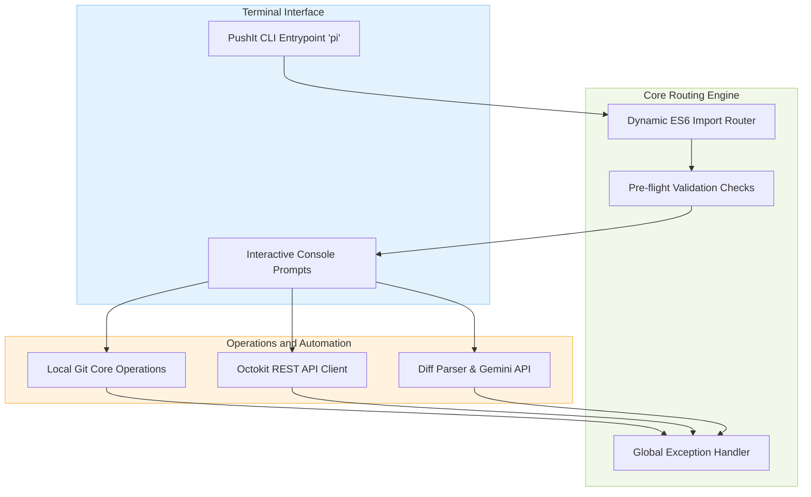

<div align="center">
  <h1>PushIt CLI (v2.0)</h1>
  <p><b>Advanced Interactive GitHub Workflow and Developer Productivity Engine</b></p>

  [](https://www.npmjs.com/package/pushit-cli)
  [](#license)
  []()
  
  <br />

  **If you find PushIt CLI helpful, please give it a Star on GitHub!**
</div>

---

## 1. Overview

PushIt CLI (`pi`) is an enterprise-grade, terminal-native application designed to optimize and automate the modern developer's Git and GitHub workflows. 

By abstracting complex Git operations and GitHub REST API interactions into a centralized, interactive command-line dashboard, PushIt CLI drastically reduces context switching. From algorithmic AI commit generation to granular interactive file staging and robust undo management, the CLI serves as a unified productivity tool for software engineering teams.

## 2. Core Capabilities (v2.0)

With the release of version 2.0, the codebase has been completely rewritten in strict TypeScript to ensure maximum type safety, speed, and long-term architectural stability.

### Algorithmic Commit Generation (Gemini 1.5 Integration)
PushIt CLI eliminates the cognitive load of drafting commit messages by interfacing directly with the Google Gemini 1.5 Flash API. When invoked, the engine performs a complete analysis of your `git diff --staged` buffer and algorithmically synthesizes three conventional commit messages (`feat`, `fix`, `chore`, etc.) that accurately describe your code alterations. This ensures a pristine, highly readable Git history without manual overhead.

### Zero-Config Local Mode
Authentication with GitHub is no longer a strict prerequisite. PushIt CLI gracefully degrades into a highly capable local Git manager. Developers can navigate branches, view chronological commit histories, and execute standard pushes securely on local repositories without ever exposing or configuring a GitHub API token.

### Automated Repository Connection
If the CLI is executed within an uninitialized directory, its middleware detects the absence of a `.git` structure and intelligently pauses execution. It will automatically prompt the developer to initialize the directory and securely bind it to an existing remote GitHub repository URL. It handles the `git init`, branch synchronization, remote attachment, and `fetch` operations in the background.

### Granular Interactive Staging
PushIt CLI replaces blunt `git add .` operations with a precise, multi-select terminal buffer. The CLI displays the current file tree status, allowing developers to meticulously curate their staging area by selectively including or excluding modified files using intuitive keyboard navigation.

---

## 3. Installation & Setup

PushIt CLI is distributed as a global Node.js binary. Ensure your local environment meets the minimum requirements before installation.

### 3.1 Prerequisites
- **Node.js**: Version 18.0.0 or higher.
- **Git**: Installed and available in your system path.

### 3.2 Global Installation
Install the package globally via NPM to register the binary commands:

```bash
npm install -g pushit-cli
```

### 3.3 Initializing the AI Assistant (Optional)
To leverage the algorithmic commit generator, you must provide the CLI with a secure execution key:
1. Obtain a free API Key from Google AI Studio.
2. Execute `pi` in your terminal and select **Settings & Config** -> **Configure AI Commit Assistant**.
3. Input the key. The credentials are encrypted and stored locally via a secure persistent configuration map. 

---

## 4. System Architecture & Design

PushIt CLI is engineered as an open-source, extensible platform. It utilizes a modular, middleware-driven architecture to ensure fault tolerance and rapid execution times.


```mermaid
graph TD
    subgraph TerminalInterface [Terminal Interface]
        CLI[PushIt CLI Entrypoint 'pi']
        Prompts[Interactive Console Prompts]
    end

    subgraph CoreRoutingEngine [Core Routing Engine]
        Router[Dynamic ES6 Import Router]
        Middleware[Pre-flight Validation Checks]
        Error[Global Exception Handler]
    end

    subgraph OperationsAutomation [Operations and Automation]
        GitOps[Local Git Core Operations]
        GitHubAPI[Octokit REST API Client]
        AIEngine[Diff Parser & Gemini API]
    end

    CLI --> Router
    Router --> Middleware
    Middleware --> Prompts
    
    Prompts --> GitOps
    Prompts --> GitHubAPI
    Prompts --> AIEngine
    
    GitOps --> Error
    GitHubAPI --> Error
    AIEngine --> Error

    style TerminalInterface fill:#e3f2fd,stroke:#90caf9
    style CoreRoutingEngine fill:#f1f8e9,stroke:#aed581
    style OperationsAutomation fill:#fff3e0,stroke:#ffb74d
```

### 4.1 Architectural Principles
1. **Dynamic Command Registry**: To maintain sub-second startup times, command modules (`src/commands/*.ts`) are never bundled into a monolithic execution block. They are strictly lazy-loaded at runtime based on the user's navigational selection.
2. **Pre-Flight Middleware**: A middleware layer intercepts all executions to validate the directory state and environment (e.g., verifying the presence of a `.git` structure or a valid authentication token) before yielding control to the specific operation, preventing cryptic runtime crashes.
3. **Graceful Degradation**: Centralized synchronous and asynchronous exception handlers ensure that network timeouts, malformed Git states, or rate-limited API responses do not crash the terminal or leave orphaned background processes.

---

## 5. Open Source Contribution

PushIt CLI is built by the community, for the community. We highly encourage developers to contribute features, architectural optimizations, or documentation improvements.

### 5.1 Local Development Environment

1. **Clone the Repository**
```bash
git clone https://github.com/abhijeetnardele24-hash/pushit-cli.git
cd pushit-cli
```

2. **Install Dependencies**
```bash
npm install
```

3. **Compile the TypeScript Source**
```bash
npm run build
```

4. **Symlink the Binary**
Link the local package to your global node execution path to test the CLI live:
```bash
npm link
```

### 5.2 Pull Request Guidelines
- Ensure all new command modules adhere to the dynamic import structure.
- Run local compilation checks (`npx tsc`) before submitting a PR to ensure strict typing is maintained.
- Clearly describe the architectural intent of any new feature in your PR description.

---

## 6. License

This software is distributed under the [MIT License](LICENSE).
